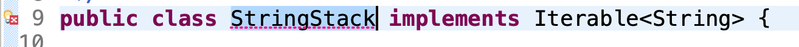
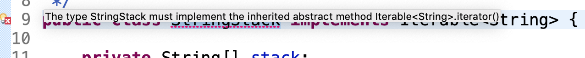
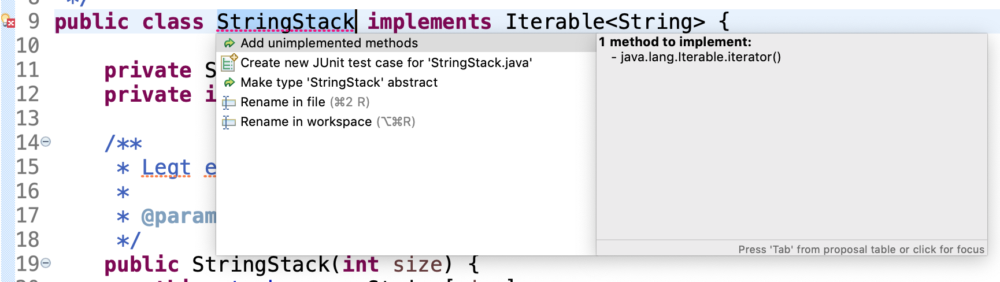

# Aufgabe: Iterator schreiben

## Lernziel

Für eine gegebenen Klasse einen Iterator schreiben.

## Umgebung

  * Eclipse

## Aufgabe

In dieser Aufgabe sollen Sie für eine bereits vorhandene Klasse einen Iterator schreiben. Bei dieser Klasse (`StringStack`) handelt es sich um einen sehr einfach (und nicht sehr sicher) programmierten Stack, der Elemente vom Typ `String` speichern soll.

Implementieren Sie in `StringStack` das Interface `Iterable<T>` und schreiben Sie, wie vom Interface verlangt einen `Iterator` für die Klasse. 

Dazu müssen Sie eine neue Klasse implementieren, die den `Iterator` für den `StringStack`  enthält. Diese Klasse braucht Instanzvariablen, um die Daten des `StringStack` zu speichern, die beim Iterieren zurückgegeben werden sollen, und um sich zu merken, an welcher Stelle der Iterator gerade ist.

Benutzen Sie die Tests in `TestStack`, um zu überprüfen, dass Ihre Implementierung des Iterators richtig funktioniert. Hierzu müssen Sie die entsprechenden Tests allerdings erst einkommentieren.

## Lösungsskizze

* Die Klasse `StringStack` muss geändert werden, eine neue Klasse (hier `StringStackIterator`) muss erstellt werden und die Tests in `TestStack` müssen entkommentiert werden. 

### `StringStack` iterierbar machen
* Die Klasse muss das Interface `Iterable` implementieren. 
* Dieser Typ braucht nicht importiert werden, da er sich im Package `java.lang` befindet. 
* `Iterable` ist ein generischer Typ mit Typ-Parameter (ohne Typ-Parameter spricht man vom *raw type*). Er gibt an, von welchem Typ die vom `Iterator` zurückgegebenen Elemente sind. Im Fall des `StringStack` werden Elemente vom Typ `String` zurückgegeben. Die Klasse `StringStack` muss also das parametrisierte Interface `Iterable<String>` implementieren.
* Das Interface verlangt, die Methode `iterator()` zu implementieren.
* Man kann sich einen Teil dieser Arbeit von Eclipse abnehmen lassen. Dazu kann man die Fehlermarkierung im Editor links neben dem Beginn der Klasse benutzen:

* Wird die Maus über die Fehlermarkierung links neben bem Editor geführt, erscheint eine textuelle Beschreibung des Fehlers:

* Durch Klick auf die Fehlermarkierung erscheint eine Liste von Aktionen, die den Fehler beheben können.

* Wählen Sie hier *"Add unimplemented methods"*.
* Es wird ein passender Rumpf generiert:

	@Override
	public Iterator<String> iterator() {
	    // TODO Auto-generated method stub
	    return null;
	}
	
* Da die Methode `iterator()` überschrieben wird, ist es nützlich dies mit der Annotation `@Override` deutlich zu machen und dadurch eine Reihe von Fehlern, die man machen kann (z.B. falscher Rückgabetyp, falsche Parameterliste, flascher Methodenname), für den Compiler in vielen Situationen auffindbar zu machen.
* Als `Iterator<String>`-Objekt wird eine neue Instanz einer neuen noch zu schreibenden Klasse zurückgeliefert.

### `Iterator<String>` für `StringStack` schreiben
* Die eigene `Iterator`-Klasse muss das Interface `Iterator<String>` implementieren.
* Außerdem werden zwei Instanzvariablen benötigt, die von außen nicht zugreifbar sein sollten:

    private String[] stack;
    private int pos;

* In `this.stack` wird das Array der Elemente gehalten, in `this.pos` wird vermerkt, welches das letzte vom `Iterator` mit `next()` zurückgegebene Element war.
* Um diese beiden Instanzvariablen zu setzen, gibt es einen Konstruktor mit zwei Parametern für diese beiden Instanzvariablen.
* Dabei arbeitet der `Iterator` nach dem selben Prinzip wie `StringStack`: Das Array wird (da es vom `StringStack` übernommen wird) vom Index `0` beginnend mit Elementen gefüllt. Beim Füllen wird in `StringStack` die `this.pos` Instanzvariable immer um `1` erhöht. `this.pos` ist in `StringStack` immer um `1` größer als der Index des als nächstes bei `pop()` oder `peek()` zurückzugebenden Elements. Wird im `Iterator` das nächste Element mit `next()` zurückgegeben, muss die Instanzvariable `this.pos` des `Iterators` also um `1` verringert werden. 
* Ist `this.pos > 0` kann bei `next()` das nächste Element dadurch gefunden werden, dass `this.pos` zuerst um `1` verringert wird und dann das Element von `this.stack` an dem Index des neuen `this.pos` zurückgegeben wird.  
* Die Methode `hasNext()` prüft deshalb, ob diese Instanzvariable `this.pos` noch nicht `0` (also größer) ist.

### Tests
* Entkommentieren (markieren Sie die kommentierten Zeilen und nutzen Sie die Eclipse-Funktion *Toggle Comment* im Menü *Source*.
* Die Tests für den `Iterator` sind in der Methode `testIterator()`. 
* In Zeile 52 wird eine foreach-Schleife verwendet, die vom Compiler in das Holen eines Iterators und eine Schleife verwendet wird, die an dem geholten Iterator in jedem Durchlauf `hasNext()` prüft und dann im Schleifenrumpf das nächste Element vom `Iterator` mit `next()` abruft.
* Außerdem wird vom selben `StringStack`-Objekt ein zweiter Iterator geholt und geprüft, dass er auch wieder dieselbe Sequenz von Elementen liefert, wie der erste Iterator. Dadurch wird sichergestellt, dass die `Iterator`-Position nicht im zu iterierenden Objekt gespeichert wird, sondern, dass jeder Iterator seinen eigenen Zustand hat, der von allen anderen getrennt behandelt wird.
